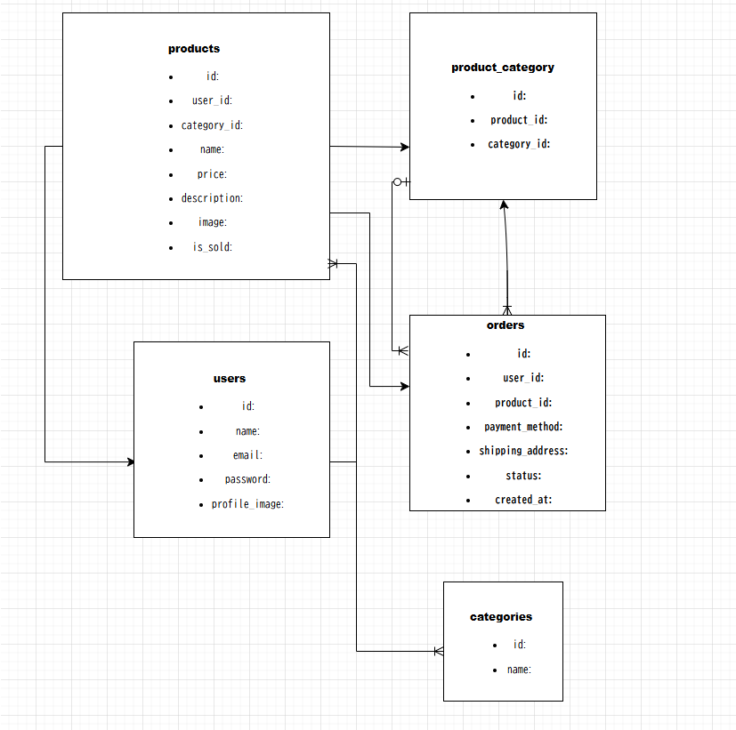

# 勤怠管理アプリ

## プロジェクト概要
スタッフの勤怠管理および申請業務を行うアプリケーションです。

## 環境構築

1. Dockerを起動する
2. プロジェクト直下で、以下のコマンドを実行する
   → `make init`

### メール認証
mailtrapというツールを使用しています。
以下のリンクから会員登録をしてください。
https://mailtrap.io/

メールボックスのIntegrationsから「Laravel 7.x and 8.x」（またはお使いのバージョン）を選択し、 `.env` ファイルの `MAIL_MAILER` から `MAIL_ENCRYPTION` までの項目をコピー＆ペーストしてください。
`MAIL_FROM_ADDRESS` には任意のメールアドレスを入力してください。

---

## ルート・コントローラー・ビュー設計一覧

| 画面名称 | パス | メソッド | コントローラー / アクション | 認証 | bladeファイル名 |
| :--- | :--- | :--- | :--- | :---: | :--- |
| **会員登録画面（一般）** | `/register` | GET / POST | `RegisteredUserController@create` / `store` | 不要 | `auth.register` |
| **ログイン画面（一般）** | `/login` | GET / POST | `AuthenticatedSessionController@create` / `store` | 不要 | `auth.login` |
| **出勤登録画面（一般）** | `/attendance` | GET / POST | `AttendanceController@index` / `store` | **必須** | `attendance.index` |
| **勤怠一覧画面（一般）** | `/attendance/list` | GET | `AttendanceController@list` | **必須** | `attendance.list` |
| **勤怠詳細画面（一般）** | `/attendance/detail/{id}` | GET / POST | `AttendanceController@detail` / `update` | **必須** | `attendance.detail` |
| **申請一覧画面（一般）** | `/stamp_correction_request/list` | GET | `StampCorrectionRequestController@list` | **必須** | `request.list` |
| **ログイン画面（管理者）** | `/admin/login` | GET / POST | `Admin\AuthenticatedSessionController@create` / `store` | 不要 | `admin.login` |
| **勤怠一覧画面（管理者）** | `/admin/attendance/list` | GET | `Admin\AttendanceController@list` | **必須** | `admin.attendance.list` |
| **勤怠詳細画面（管理者）** | `admin/attendance/{id}` | GET / POST | `Admin\AttendanceController@detail` / `update` | **必須** | `admin.attendance.detail` |
| **スタッフ一覧画面（管理者）** | `/admin/staff/list` | GET | `Admin\StaffController@list` | **必須** | `admin.staff.list` |
| **スタッフ別勤怠一覧（管理者）** | `/admin/attendance/staff/{id}` | GET | `Admin\AttendanceController@staff` | **必須** | `admin.attendance.staff` |
| **申請一覧画面（管理者）** | `/stamp_correction_request/list` | GET | `Admin\StampCorrectionRequestController@list` | **必須** | `admin.request.list` |
| **修正申請承認画面（管理者）** | `/stamp_correction_request/approve/{id}` | GET / POST | `Admin\StampCorrectionRequestController@show` / `approve` | **必須** | `admin.request.approve` |

---

## モデル設計

| モデルファイル名 | 説明 |
| :--- | :--- |
| **`User.php`** | 一般ユーザー（従業員）および管理者のアカウント情報を管理するモデル。 |
| **`Attendance.php`** | 日々の出勤・退勤・休憩開始・休憩終了の時刻や日付を記録するモデル。 |
| **`Rest.php`** | 1回の勤務に対して複数回発生する可能性のある「休憩時間」を個別に記録するモデル。 |
| **`StampCorrectionRequest.php`** | ユーザーから提出された「勤怠修正申請」の状態（承認待ち・承認済みなど）を管理するモデル。 |

---

## バリデーション設計

| バリデーションファイル名 | 対象フォーム | ルール（概要） |
| :--- | :--- | :--- |
| **`RegisterRequest.php`** | 会員登録フォーム | `name`: 必須 `email`: 必須、メール形式、重複不可 `password`: 必須、8文字以上、確認用一致 |
| **`LoginRequest.php`** | ログインフォーム | `email`: 必須、メール形式 `password`: 必須 |
| **`AttendanceRequest.php`** | 打刻申請フォーム | `user_id`: 必須、存在するユーザーID 二重打刻（同日に出勤が2回など）のチェック |
| **`StampCorrectionRequest.php`** | 勤怠修正・申請フォーム | `date`: 必須、日付形式 `clock_in`: 必須、時刻形式 `clock_out`: 必須、時刻形式（出勤より後の時刻であること） `reason`: 必須、文字列（理由の記入） |

---

## ER図

---

## テストアカウント

### 一般ユーザー
- **ログインURL**: http://localhost/login
- **メールアドレス**: `test3@test.com`
- **パスワード**: `3333333333`

### 管理者ユーザー
- **ログインURL**: http://localhost/admin/login
- **メールアドレス**: `admin@example.com`
- **パスワード**: `password`

---

## PHPUnitを利用したテストに関して
本アプリケーションには、機能が正しく動作するかを検証するための自動テスト（PHPUnit）が導入されています。

### テストの実行手順

1. **Dockerコンテナ内に入る**
   コンテナが起動している状態で、以下のコマンドでコンテナ内に入ります。
   → `docker-compose exec php bash`

2. **テストコマンドを実行する**
   コンテナ内のプロジェクト直下で以下のコマンドを実行し、すべてのテストが通過することを確認します。
   → `php artisan test`
